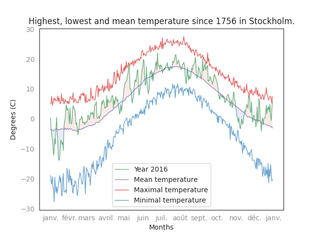

# Datavisualisation

I store in this repository some plot and visualisation I made.

## Temperature in Stockholm

Visualisation of mean, highest and lowest temperature for each day of the year since 1756.

    

Visualisation of the evolution of the temperature in Stockholm.

    

### Reference  

[1] Anders Moberg (2020) Stockholm Historical  Weather Observations — Daily mean air temperatures since 1756. Dataset version 2. Bolin Centre Database. https://doi.org/10.17043/stockholm-historical-daily-temperature-2